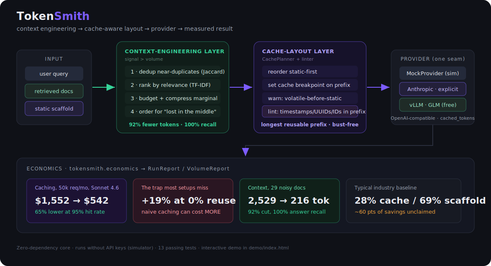
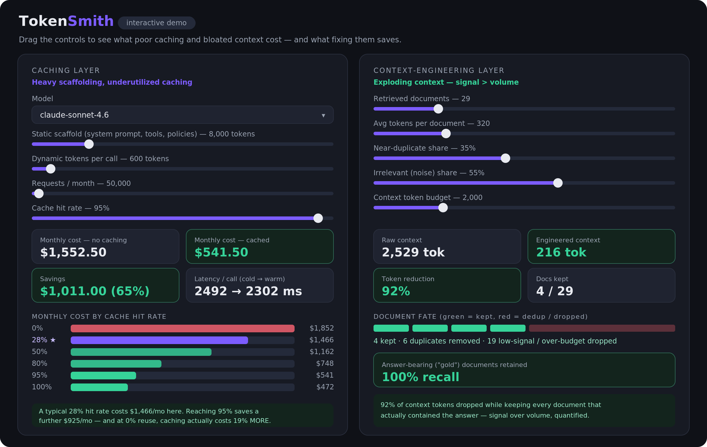

# TokenSmith

[](https://github.com/wzltmp/TokenSmith/actions/workflows/ci.yml)


**A provider-agnostic toolkit for prompt-cache optimization and context engineering.**

TokenSmith turns two well-documented problems in production LLM systems into
working, measurable engineering:

> **Problem 1 — Heavy scaffolding, underutilized caching.** In measured
> production traces, roughly **69%** of input tokens are system prompts
> (instructions, policies, tool guidance), yet only about **28%** of calls to
> cache-capable models actually read from cache. Most calls re-process the
> entire prompt every time.

> **Problem 2 — Exploding context.** Context windows have grown to ~2M tokens
> and median tokens-per-request has more than doubled year over year. Volume is
> no longer the bottleneck — *context quality is.* Noise and redundancy drown
> out the signal, and critical details get buried in long inputs.

TokenSmith addresses both: a **caching layer** that lays out prompts so the
static scaffolding is a reusable, cacheable prefix, and a **context-engineering
layer** that dedups, ranks, compresses, and budgets retrieved context so only
high-signal tokens reach the model. It runs against Anthropic, OpenAI, or a
built-in deterministic simulator — so the whole thing works, and is testable,
with **zero API keys**.



---

## Why it matters (measured)

All numbers below come from the included benchmarks running on the deterministic
simulator with published June 2026 pricing. Reproduce with
`python benchmarks/bench_caching.py` and `python benchmarks/bench_context.py`.

### Caching — a heavily scaffolded agent, 50k requests/month, Claude Sonnet 4.6

An 8,000-token static scaffold (93% of input) with 600 dynamic tokens per call.

| Cache hit rate | Monthly cost | Saved vs. no cache |
|---:|---:|---:|
| 0% (caching on, no reuse) | $1,852.50 | **−19%** ⚠️ |
| **28% (industry adoption)** | $1,466.10 | 6% |
| 50% | $1,162.50 | 25% |
| 80% | $748.50 | 52% |
| 95% | $541.50 | **65%** |
| 100% | $472.50 | 70% |

No-cache baseline: **$1,552.50/month.**

Two things this surfaces that a one-liner "caching saves money" misses:

1. **The typical ~28% adoption rate leaves ~60 points of savings on the
   table.** Moving from a 28% to a 95% hit rate cuts this workload's bill by
   roughly **$925/month**.
2. **Caching naively can cost *more*.** With explicit (Anthropic-style) caching,
   every cache *miss* pays a write surcharge (1.25×). On a workload with no
   prefix reuse (0% hit rate), that's a **19% loss** — which is exactly why
   prompt *layout* (the usual culprit) matters more than just flipping
   caching on.

### Context engineering — noisy retrieval, 29 documents

A query answered by 3 "gold" documents, buried among 6 near-duplicates and 20
irrelevant filler docs.

| Metric | Result |
|---|---|
| Documents | 29 → 4 after dedup → 4 kept |
| Context tokens | 2,529 → **216 (92% reduction)** |
| Gold recall | **100%** (kept every answer-bearing document) |

The pipeline threw away 92% of the context tokens *while keeping every document
that actually contained the answer* — the signal-over-volume principle,
quantified.

---

## Install & run (no keys required)

```bash
cd TokenSmith
pip install -e .            # core has zero dependencies
python -m tokensmith        # end-to-end demo on the simulator
python benchmarks/bench_caching.py
python benchmarks/bench_context.py
pytest                      # 25 tests, all green without any SDK
```

Optional extras: `pip install -e ".[tokenizer]"` (accurate counts via tiktoken),
`".[anthropic]"`, `".[openai]"`, or `".[all]"`.

### Use it in code

Project what caching saves on a heavily scaffolded workload:

```python
from tokensmith import project_volume, get_price

rep = project_volume(
    static_tokens=8000, dynamic_input_tokens=600, output_tokens=350,
    requests=50_000, price=get_price("claude-sonnet-4.6"), cache_hit_rate=0.95)
print(rep.render())
# Cost (no cache): $1,552.50
# Cost (cached):   $541.50
# Savings:         $1,011.00 (65%)
```

Run the full context-engineering + cache-layout pipeline against any provider
(here the keyless simulator):

```python
from tokensmith import Pipeline, MockProvider, Document

pipe = Pipeline(MockProvider("claude-sonnet-4.6"), context_budget_tokens=600)
docs = [Document(str(i), f"Knowledge item {i}. ...") for i in range(12)]
report = pipe.run("summarize knowledge item 3",
                  scaffold="You are a support agent. " * 200, documents=docs)
print(report.render())   # dedup + budget + cache layout, with a token/cost diff
```

### Interactive demo

Open `demo/index.html` in any browser — no build step, no server. Sliders for
scaffold size, request volume, model, and cache hit rate recompute cost and
latency live, with a side panel showing context-engineering token savings.



### Prove caching against a real **free** model (no paid API)

The same `OpenAIProvider` talks to any OpenAI-compatible endpoint — just change
`base_url`. `examples/real_cache_run.py` sends one large static prefix twice and
prints the *actual* `cached_tokens` the server reports on the warm call:

```bash
# Self-hosted vLLM — fully free, you own the KV cache:
vllm serve Qwen/Qwen2.5-0.5B-Instruct --enable-prefix-caching
BASE_URL=http://localhost:8000/v1 MODEL=Qwen/Qwen2.5-0.5B-Instruct \
    python examples/real_cache_run.py

# Open-weights GLM via Z.ai (cheap/free trial credits):
BASE_URL=https://api.z.ai/api/paas/v4 MODEL=glm-5.2 \
    API_KEY=$ZAI_API_KEY python examples/real_cache_run.py
```

Expected: `call 1` reports `cached_read=0` (cold), `call 2` reports a large
`cached_read` (warm prefix reuse). Both vLLM (`--enable-prefix-caching`) and
Z.ai GLM expose this via the same `usage.prompt_tokens_details.cached_tokens`
field, which the provider parses uniformly. The wiring is verified in CI by
`test_live_provider_sees_cache_on_warm_call`, which runs the provider against a
stdlib mock server that returns that field — so the integration is proven
end-to-end without spending a cent.

### Lint a prompt for cache-busting content

```python
from tokensmith import Segment, lint_prompt
report = lint_prompt([Segment("system", my_system_prompt, static=True)])
print(report.render())
```
```
12 cache-bust risk(s) found:
  [HIGH  ] system@14: iso_datetime -> '2026-06-26T14:03:55Z'
  [HIGH  ] system@54: labeled_id   -> 'request_id: req-8842.'
  [HIGH  ] system@84: uuid         -> '550e8400-e29b-41d4-a716-446655440000'
  ! A risk sits at the very start of a static block; it invalidates the ENTIRE cacheable prefix.
```

---

## Architecture

```
src/tokensmith/
├── tokenizer.py        token counting (tiktoken or calibrated heuristic)
├── pricing.py          per-model rates + cache mechanics (Anthropic & OpenAI)
├── economics.py        Usage accounting, per-call cost, volume projection
├── caching/
│   ├── planner.py      CachePlanner: static-first layout, breakpoints, warnings
│   └── lint.py         cache-bust linter + drift detector (volatile-in-static)
├── context/
│   ├── compress.py     dedup, TF-IDF relevance ranking, extractive compression,
│   │                   "lost in the middle" reordering
│   └── budget.py       greedy token budgeting with marginal-doc compression
├── providers/
│   ├── base.py         Provider ABC + Completion/Usage
│   ├── mock.py         deterministic cache simulator (cost + latency)
│   ├── anthropic_provider.py   explicit cache_control breakpoints
│   └── openai_provider.py      OpenAI / vLLM / Z.ai GLM / Ollama (base_url)
└── pipeline.py         context engineering → cache layout → provider → report
```

### The provider abstraction

A `Provider` takes prompt **segments** (each marked static/cacheable or
volatile) plus a query, and returns a `Completion` with a token `Usage`
breakdown. The same `Pipeline` runs unchanged across:

| Provider | Cache model | How the layout maps |
|---|---|---|
| `MockProvider` | TTL keyed on prefix hash | tests, demo, benchmarks — no keys |
| `AnthropicProvider` | **explicit** — write 1.25×/2×, read 0.1× | static segments → `system` blocks; `cache_control: ephemeral` on the last static block |
| `OpenAIProvider` | **automatic** — discounted reads | static-first ordering maximizes the auto-cached prefix; works with OpenAI **and** free backends |

The one `OpenAIProvider` covers every OpenAI-compatible server via `base_url`:
OpenAI, **vLLM** (self-hosted, free), **Z.ai GLM** (open weights), Ollama, and
OpenRouter. `get_provider("vllm")` / `get_provider("glm")` ship sensible
defaults. Cache telemetry is read from `usage.prompt_tokens_details.cached_tokens`
— the field vLLM, GLM, and OpenAI all share.

### The caching insight, in code

`CachePlanner` reorders segments so every static block precedes the first
volatile one (the longest possible reusable prefix), and emits warnings for the
most common cache-killing anti-patterns:

- volatile content injected *before* static scaffolding (breaks prefix reuse),
- a cacheable prefix below the model's minimum (e.g. 1,024 tokens) that will
  silently never cache.

The **cache-bust linter** (`caching/lint.py`) goes one level deeper — a common
failure mode is "stable" blocks getting rewritten between requests, and this is
the tooling to catch it. `lint_prompt` statically scans blocks you *marked* static
for embedded volatile tokens (timestamps, UUIDs, request/trace IDs, bearer
tokens, "current date"), ranks them by offset (an offending token at offset 0
invalidates the whole prefix), and `CacheBustDetector` does the dynamic check:
feed it successive renders and it reports the real-world **bust rate** of any
"static" block whose content actually changed between calls.

### The context-engineering pipeline

1. **Dedup** near-duplicate documents (Jaccard over 3-word shingles).
2. **Rank** by TF-IDF cosine similarity to the query (embedding-free, swappable).
3. **Budget** — greedily fit the highest-signal docs to a token limit, and
   *compress* the marginal doc (extractive, top-sentences) instead of dropping
   it whole when it nearly fits.
4. **Order** to mitigate "lost in the middle" — strongest docs at both edges.

---

## Pricing sources

Default rates in `pricing.py` reflect published figures as of June 2026 and are
fully overridable. Cache mechanics:

- **Anthropic** — cache *reads* are billed at 0.1× the base input rate; 5-minute
  cache *writes* at 1.25×, 1-hour writes at 2×. (e.g. Sonnet 4.6 read $0.30/M
  vs. $3/M input.) — [Anthropic prompt caching docs](https://platform.claude.com/docs/en/build-with-claude/prompt-caching), [Anthropic pricing](https://platform.claude.com/docs/en/about-claude/pricing)
- **OpenAI** — automatic prefix caching, no write surcharge, cached input
  discounted 50–90% by model (e.g. GPT-5.5 cached input $0.50/M vs. $5/M);
  minimum 1,024-token prefix, cached in 128-token increments. — [OpenAI prompt caching](https://openai.com/index/api-prompt-caching/), [OpenAI API guide](https://developers.openai.com/api/docs/guides/prompt-caching)
- **Z.ai GLM** (open weights: GLM-5.2 / GLM-4.6) — context caching reports
  `cached_tokens`; repeated prefix bills ~$0.26/M vs. $1.40/M input (~81% off
  the repeated part). — [Z.ai context caching](https://docs.z.ai/guides/capabilities/cache)
- **vLLM** (self-hosted, free) — automatic prefix caching via
  `--enable-prefix-caching`; surfaces `cached_tokens` in `prompt_tokens_details`.
  Marginal cost is $0, so the toolkit reports token + latency savings instead of
  dollars. — [vLLM automatic prefix caching](https://docs.vllm.ai/en/latest/design/v1/prefix_caching.html)

Output prices for some tiers are representative defaults; set them to your
contract rates in `MODELS` (or build one with `free_model_price(...)`).

---

## Design notes & limitations

- The simulator models cache **economics and latency**, not model quality; it's
  for cost/layout decisions, not answer-quality evaluation.
- TF-IDF ranking is deliberately dependency-free so the toolkit runs anywhere.
  The `rank_by_relevance` / `compress_document` interfaces are the seam to drop
  in real embeddings for production.
- The latency model treats cache hits as skipping prefill compute; on
  long-output calls, decode time dominates total latency, so the *total*-latency
  win from caching is smaller than the time-to-first-token win.

## License

MIT — see `LICENSE`.
